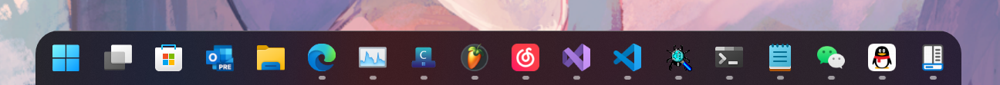

# ClippedTB
#### Add margins, rounded corners as clip region to your taskbars!   
Most importantly, it is **anti-aliased**!

- Compatible with RoundedTB!   
- Compatible with TranslucentTB!
- Compatible with TranslucentFlyouts!   
- Compatible with StartAllBack!
- Compatible with ExplorerPatcher!

## To use
The simplest way to use ClippedTB is by simply entering margins and corner radius.
 - **Margins** - controls how many pixels to remove from each side of the taskbar, creating a margin around it that you can see but cannot click through.
 -  **Corner Radius** - adjusts how round the corners of the taskbar should be.
## Known issues
- The auto-hide taskbar cannot be perfectly clipped when a UWP goes into its full-screen mode.
- Restart dwm will possibly crash ClippedTB when you recently have added/removed monitors
## Limitations
- Cannot split taskbars
- Cannot adjust hittest retangles
- Only accept one clip region
## Dependencies and References
### [Microsoft Research Detours Package](https://github.com/microsoft/Detours)  
Detours is a software package for monitoring and instrumenting API calls on Windows.  
### [VC-LTL - An elegant way to compile lighter binaries.](https://github.com/Chuyu-Team/VC-LTL5)  
VC-LTL is an open source CRT library based on the MS VCRT that reduce program binary size and say goodbye to Microsoft runtime DLLs, such as msvcr120.dll, api-ms-win-crt-time-l1-1-0.dll and other dependencies.  
### [Windows Implementation Libraries (WIL)](https://github.com/Microsoft/wil)  
The Windows Implementation Libraries (WIL) is a header-only C++ library created to make life easier for developers on Windows through readable type-safe C++ interfaces for common Windows coding patterns.  
### [RoundedTB - README.md](https://github.com/RoundedTB/RoundedTB/blob/master/README.md) 